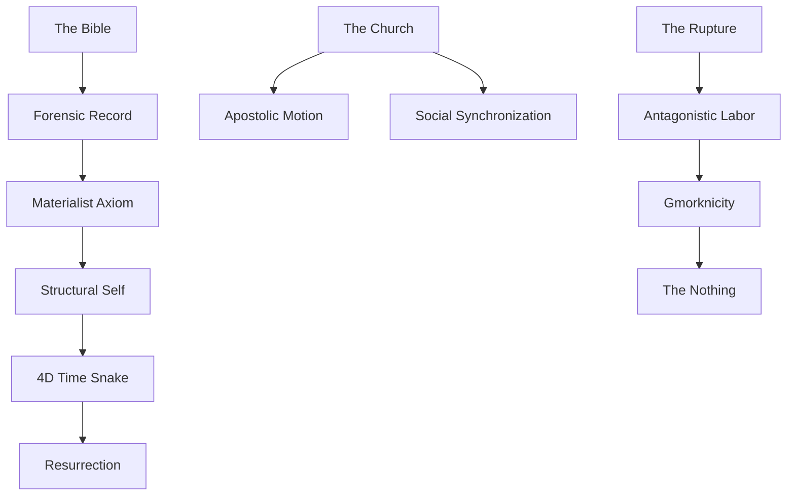

# Materialist Christianity: Structural Map (Knowledge Graph)

This registry maps the mechanical connections between the foundational axioms, behavioral nodes, and biblical teardowns.

## I. The Theoretical Substrate (Essays)
The core frameworks defining the Materialist Christianity lens.

*   **[The Materialist Axiom](/wiki/essays/the_materialist_axiom)**: The fundamental claim that behavior precedes belief.
    *   *Connects to:* [The Kingdom of Labor](/wiki/essays/the_kingdom_of_labor), [Scripture as Behavioral History](/wiki/essays/scripture_behavioral_history).
*   **[The Industrial Real](/wiki/essays/the_industrial_real)**: Reality as a series of physical, industrial processes.
    *   *Connects to:* [The Commodity Form](/wiki/nodes/the_commodity_form).
*   **[The Structural Self](/wiki/essays/the_structural_self)**: Identity as the sum of physical connections and local labor.
    *   *Connects to:* [Fractal Theory of Self](/wiki/essays/fractal_theory_of_self), [4D Time Snake](/wiki/nodes/4d_time_snake).

---

## II. Behavioral Mechanics (Nodes)
Atomic units of social and individual physics.

### 1. The Physics of the Individual
*   **[4D Time Snake](/wiki/nodes/4d_time_snake)**: Temporal persistence of trajectory.
    *   *Requires:* [Consequence as Truth](/wiki/nodes/consequence_as_truth).
    *   *Feeds into:* [Resurrection (Structural)](/wiki/nodes/resurrection_structural).
*   **[Behavioral Gravity](/wiki/nodes/behavioral_gravity)**: The pull of established social and physical habits.
*   **[The Haunted Object](/wiki/nodes/the_haunted_object)**: Matter imbued with social meaning/debt (The Commodity).

### 2. The Physics of the Collective
*   **[The Church as Structural Anchor](/wiki/nodes/the_church_as_structural_anchor)**: A node designed for multi-generational trajectory stability.
    *   *Connects to:* [Apostolic Motion](/wiki/nodes/apostolic_motion), [Social Synchronization Engine](/wiki/nodes/social_synchronization_engine).
*   **[Antagonistic Labor](/wiki/nodes/antagonistic_labor)**: Labor used to extract from the neighbor rather than maintain the substrate.
    *   *Connects to:* [Gmorknicity](/wiki/nodes/gmorknicity).

---

## III. The Biblical Baseline (MCSB)
The historical record of the unfolding dialectic.

### The Genesis Cycles
*   **[Genesis 1:1—2:3 (The Rhythm)](/wiki/bible/gen_1_rhythm)**: The establishment of the Seventh Day Protocol.
    *   *Mechanical Output:* [The Materialist Axiom](/wiki/essays/the_materialist_axiom).
*   **[Genesis 2:4—3:24 (The Rupture)](/wiki/bible/gen_2_3_rupture)**: The break in the human-substrate interface.
    *   *Mechanical Output:* [The Nothing](/wiki/nodes/the_nothing), [Antagonistic Labor](/wiki/nodes/antagonistic_labor).
*   **[Genesis 4—11 (The Reset)](/wiki/bible/gen_4_11_reset)**: Accumulation of noise (Qayin/Babel) leading to mechanical collapse.
*   **[Genesis 12—25 (The Property)](/wiki/bible/gen_12_25_property)**: The transition to the Covenant as a property-management protocol.
*   **[Genesis 26—36 (The Well-Water)](/wiki/bible/gen_26_36_cycle)** [IN PROGRESS]: The physics of friction, inheritance, and the Well-Water Principle.

---

## IV. Core Connections (The Web)

